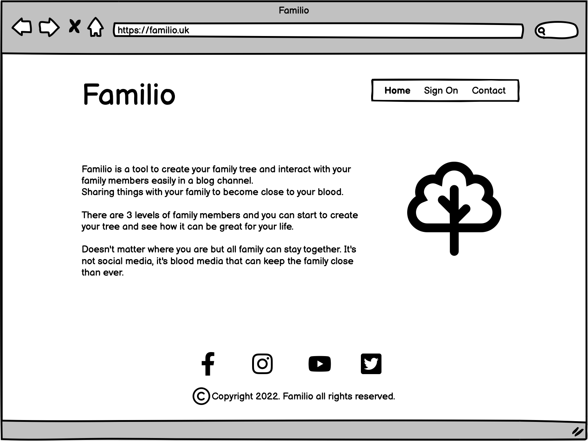

# Familio


Family3 is a tool to create your family tree and interact with your family levels easy in a blog, sharing things with the family to get closer to your family member.

There are 3 levels of the family to interact. Start to create your tree and see how it can be great for your life. Doesn’t matter where you are but all family can stay together. It’s not social media, it’s blood social media that can keep the family close to you.

Welcome to Familio!


[Click here to access the tool](https://familio-app.herokuapp.com//)

## User Experience (UX)
---

### Features
-	Comments
-	Photos
-	Registers
-	Family groups
-	Share with family

### Tips
1.	Register Create your family tree
2.	Send an invite to a member family
3.	Create a group according to your preference 
4.	Start to share details with family levels and groups
5.	The family members you have shared can comment on your post

### 1st Level Family Members
-	Sons/Daughters 
-	Brothers/Sisters/In-laws
-	Dad/Mother
-	Wife/Husband

### 2nd Level Family Members
-	1st Level
-	Grand Parents
-	Aunts/Uncles
-	Cousins
-	Nieces/Nephews

### 3rd Level Family Members
-	All in the family tree

### How to use the Family3:
-	Celebration
-	Funeral
-	Wedding
-	Party
-	New-borns
-	Others

### User Stories (Agile Methodology)

1. Create account:
 - Anybody can create an account. (Must-Have)

        Acceptance criteria:
        - Given That I have created an account.
        - When I click on Sign on and Sign Up button.
        - Then I can confirm I have access to Familio menu.

2. Send invite to a family member
 - As a User, I can send an invite to a family member to join in the Familio. (Should-Have)

        Acceptance criteria:
        - Given That I can send an invite to a family member that I want to join in the Familio.
        - When I click to send invite on Familio menu.
        - Then I can see the group created and member associated.

3. Create a group 
 - As a User, I can create a group according their preference.	(Could-Have)

        Acceptance criteria:
        - Given That I can create a group and associate member of family is already associated with me.
        - When I click to create a group on Familio menu.
        - Then I can see a card that when I click there is a rotation to provide more details.

4. Share a post text or pictures
 - As a User, I can share a post text or pictures with family members and groups. (Won't-Have)

        Acceptance criteria:
        - Given That I can share a post with text or pictures with family member and groups.
        - When I click to create a post on Familio menu.
        - Then I can see the users received my post.

5. Comments on the post
 - As a User, I can comment on the posts. (Should-Have)

        Acceptance Criteria:
        - Given That I can comment on the post.
        - When I click on comment box to comment a post.
        - Then I can see my comment and others on the post.

6. Determine my family level
 - As a User, I can determine my family member levels in 3 levels. (Must-Have)

        Acceptance Criteria:
        - Given That I can determine my family member levels in 3 different levels.
        - When I click to approve the family member and say wich level it is.
        - Then I can see the family member is a specific level in my family tree.

7. See the family tree 	
 - As a User, I can see my family tree with my family members. (Could-Have)

        Acceptance Criteria:
        - Given That I can see my family tree with my family members.
        - When I click on family tree on Familio menu.
        - Then I can see my family tree after add some members to my family.
 
8. Remove my account
 - As a User, I can remove my account.	(Must-Have)

        Acceptance Criteria:
        - Given That I can remove my account from the Familio.
        - When I click on remove account on Account menu.
        - Then I can remove my account from the Familio.

9. Change my password and email
 - As a User, I can change my password and email address. (Should-Have)

        Acceptance Criteria:
        - Given That I can change my password and email address.
        - When I click on change password or change email address on the right top after logged on.
        - Then I can change my password and some details regarding my account.

10. Approve a member
 - As a User, I can approve a member to be part of my family. (Could-Have)

        Acceptance Criteria:
        - Given That I can approve a member member to become part of my family.
        - When I click to approve the member to my family after get a notification.
        - Then I can see the member became part of family.


11. Pay a subscription
 - As a User, I can pay a subscription to get more resources.	(Should-Have)

        Acceptance Criteria:
        - Given That I can pay a subscription to get more resources like create a group and get more then 10 family members.
        - When I click to subscription on Familio menu to move from free to Familio plan.
        - Then I can see my subscription active and the extra resources enable.


### Site Map


### Design (WireFrame)

#### Home Page


#### Contact Page


#### Donate Page


#### Support Page


#### Sign In Page


#### Sign Up Page


#### User Portal


#### Contributor Portal


#### Administrator Portal


#### Send Question Page


#### Send Answer Page


#### Search Question Page


#### User list Page


### Database

#### Model Diagram


## Features 

Here describes the main features of the website and what the user can expect when viewing ~

### Existing Features:

-	Registers
-	Family groups
-	Share with family
-   Family Tree
-   Invite Member
-   Add Membes without invite
-   Remove account
-   Subscription

### Future Features:

-	Comments
-	Photos
-   Blogs

## Technologies 
### **Dev Languages Used**
  
  - Python
  - Django
  - HTML
  - CSS
  - Javascript
  - PostgreSQL
  
### **Applications Used**
  
  - [GitPod](https://www.gitpod.io/) was used as an online IDE.
  - [GitHub](https://github.com/) is used to store the projects code and version control.
  - [Heroku](https://dashboard.heroku.com/) are used to deploy the site.
  - [Character Count](https://www.charactercountonline.com/older-versions/v2/) was used to add commit with max 50 characteres.
  - [W3Schools](https://www.w3schools.com/) was used to reference code for Python, HTML, JS and CSS.
  - [Balsamiq](https://balsamiq.com/) was used to create wireframe and sitemap.
  - [DBSchema](https://dbschema.com/) was used to create the relational database.
  - [Django Docs](https://docs.djangoproject.com/) was used to reference django documentation.
 
## Testing 

### Coverage Report


### Bug

 - No bugs.
 - I have some difficult some processes for validation and customize user.
 - I have some issues to put CSS working properly into the Heroku.
 - I have issue to get my json automation working properly on Heroku.

## Deployment 

Deploying the project using Heroku:
* Visit the [Heroku](https://dashboard.heroku.com/login) site and create an account
* Click the "New" Button
* Click the "Create new app" button
* Provide a name for the app in the App name input field
* Select your region from the choose region dropdown menu 
* Click the "Create App" button
* Once redirected, proceed to the settings tab
* Click on the "config vars" button
* Supply a KEY of `PORT` and it's value of `8000`. The click the "add" button
* Next step is to add Buildpacks, click the "Add Buildpack" button
* The `python` buildpack needs to be added first then the `nodejs` buildpack
* Once the buildpacks have completed, go to the deploy screen, once in the deploy screen, select GitHub as the deployment method and connect your GitHub profile
* Search for the repository that you wish to deploy to Heroku and click "connect"
* Once your repository is connected to Heroku you can choose to either manually or automatically deploy your app.
* By selecting automatic deploys, Heroku will build a new version of the app each time a change has been pushed to the repository
* Manual deploys allow you to build a new version of your app whenever you click manual deploy
* If your build is successful you will then be able to visit the live site by clicking the link that is provided to you by Heroku

Command to add packages to requirements.txt, `pip3 freeze --local > requirements.txt` 

### Making a Local Clone

1. Log in to GitHub and locate the [GitHub Repository](https://github.com/michaelrfreitas/p4_full_helpnowwork)
2. Under the repository name, click "Clone or download".
3. To clone the repository using HTTPS, under "Clone with HTTPS", copy the link.
4. Open Git Bash
5. Change the current working directory to the location where you want the cloned directory to be made.
6. Type `git clone`, and then paste the URL you copied in Step 3.

    $ `git clone https://github.com/michaelrfreitas/p4_full_helpnowwork` 

7. Press Enter. Your local clone will be created. 

```shell
$ git clone https://github.com/michaelrfreitas/p4_full_helpnowwork
> Cloning into `CI-Clone`...
> remote: Counting objects: 10, done.
> remote: Compressing objects: 100% (8/8), done.
> remove: Total 10 (delta 1), reused 10 (delta 1)
> Unpacking objects: 100% (10/10), done.
```

Alternatively, if using Gitpod, you can click below to create your own workspace using this repository.

You will need to also install all required packages in order to run this application on Heroku, refer to [requirements.txt](requirements.txt)
* Command to install this apps requirements is `pip3 install -r requirements.txt`

# Credits 
  ### **JS OrgChart**
  

  - [Balkan](https://balkan.app/OrgChartJS)

  ### **Code/Reference** 
  - [Django Docs](https://docs.djangoproject.com/) was used to reference django documentation.

  
  ### **Acknowledgment**
  I'd like to say thank you my mentor [Benjamin Kavanagh](https://github.com/BAK2K3) for his guidance and support throughout my project.
